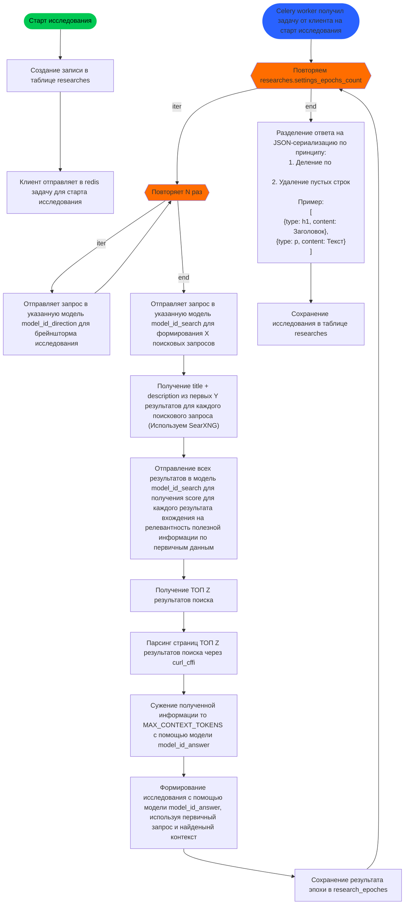

```mermaid
flowchart TB
    A(["Старт исследования"]) --> n1["Создание записи в таблице researches"]
    n1 --> n2["Клиент отправляет в redis задачу для старта исследования"]
    n3(["Celery worker получил задачу от клиента на старт исследования"]) --> n13["Повторяем researches.settings_epochs_count"]
    n5["Повторяет N раз"] -- iter --> n4["Отправляет запрос в указанную модель model_id_direction для брейншторма исследования"]
    n4 --> n5
    n5 -- end --> n6["Отправляет запрос в указанную модель model_id_search для формирования X поисковых запросов"]
    n6 --> n7["Получение title + description из первых Y результатов для каждого поискового запроса (Используем SearXNG)"]
    n7 --> n8["Отправление всех результатов в модель model_id_search для получения score для каждого результата вхождения на релевантность полезной информации по первичным данным"]
    n8 --> n9["Получение ТОП Z результатов поиска"]
    n9 --> n10["Парсинг страниц ТОП Z результатов поиска через curl_cffi"]
    n10 --> n11["Сужение полученной информации то MAX_CONTEXT_TOKENS с помощью модели model_id_answer"]
    n11 --> n12["Формирование исследования с помощью модели model_id_answer, используя первичный запрос и найденынй контекст"]
    n13 -- iter --> n5
    n12 --> n16["Сохранение результата эпохи в research_epoches"]
    n13 -- end --> n14["Разделение ответа на JSON-сериализацию по принципу:<br>1. Деление по \n<br>2. Удаление пустых строк<br><br>Пример:<br>[<br>{type: h1, content: Заголовок},<br>{type: p, content: Текст}<br>]<br>"]
    n14 --> n15["Сохранение исследования в таблице researches"]
    n16 --> n13

    n1@{ shape: rect}
    n13@{ shape: hex}
    n5@{ shape: hex}
    style A color:#000000,stroke:none,fill:#00C853,stroke-width:0px,stroke-dasharray:0
    style n3 stroke:#2962FF,stroke-width:0px,stroke-dasharray:0,fill:#2962FF
    style n13 fill:#FF6D00
    style n5 fill:#FF6D00
```