```mermaid
flowchart TB
    START(["Пользователь создаёт исследование"]) --> CREATE["POST /api/v1/researches\nСоздание записи research в БД"]
    CREATE --> CELERY["Celery task: research.run(research_id)"]
    CELERY --> STARTER["research_starter.start_research()\nВыбирает сценарий по settings_scenario_type"]

    STARTER --> NORMAL["NormalScenario"]
    STARTER --> QUESTION["QuestionScenario"]

    NORMAL --> PIPE
    QUESTION --> PIPE

    subgraph PIPE["Pipeline (одинаковый для обоих сценариев)"]
        direction TB
        D["DIRECTION\nLLM брейншторм N векторов\nмодель: model_id_direction"] --> K
        K["KEYWORDS\nLLM генерирует N поисковых запросов\nмодель: model_id_search"] --> S
        S["SEARCH\nSearXNG → scrape (curl_cffi) → clean (trafilatura)"] --> CH
        CH["SCRAPE/CHUNKING\nНарезка страниц на чанки по max_tokens\nСохранение в chunk_summaries"] --> BM
        BM["SCORING_BM25\nBM25Okapi (без LLM)\nтоп-N по bm25_score"] --> EM
        EM["SCORING_EMBED\nКосинусное сходство эмбеддингов\nмодель: model_id_embed\nтоп-N по embed_score"] --> RR
        RR["SCORING_RERANK\nLLM оценивает релевантность [0..1]\nмодель: model_id_reranker\nтоп-N по rerank_score"] --> SUM
        SUM["SUMMARIZE\nBullet-summary каждого чанка через LLM\nмодель: model_id_answer\nКэш в ChunkSummary.page_summary"] --> W
    end

    W --> WRITE_NORMAL["WRITE (Normal)\nbuild_write_normal_messages\nMarkdown → segments с цитатами [N]"]
    W --> WRITE_QUESTION["WRITE (Question)\nbuild_write_question_messages\n1–3 абзаца с цитатами"]

    WRITE_NORMAL --> RENAME
    WRITE_QUESTION --> RENAME
    RENAME["RENAME\nLLM генерирует короткое название\nмодель: model_id_answer\nПропускается если пользователь уже переименовал"] --> DONE(["COMPLETE"])

    DONE --> NEXT["Пользователь читает результат\nСтавит лайки/дизлайки на сегменты"]
    NEXT --> NEW["Запускает следующий этап\n(POST /api/v1/researches — parent_id = current)"]
    NEW --> STARTER

    SCHED_START(["Планировщик (scheduler.py)\npolling каждые 60 секунд"]) --> SCHED_CHECK["get_due_planned_schedules()\nПолучить ResearchSchedule\ngде status=PLANNED и scheduled_at <= now"]
    SCHED_CHECK --> SCHED_CREATE["create_scheduled_run()\nСоздать дочернее исследование\nrepeat_type: start | current | deep"]
    SCHED_CREATE --> CELERY
    SCHED_CREATE --> SCHED_NEXT["reschedule_next()\nПометить текущее COMPLETED\nСоздать новое PLANNED"]

    style START fill:#00C853,color:#000
    style DONE fill:#00C853,color:#000
    style SCHED_START fill:#2962FF,color:#fff
    style PIPE fill:#FF6D00,color:#fff
```

## Ветвление по сценарию

Оба сценария (`NormalScenario`, `QuestionScenario`) выполняют одинаковый pipeline, но различаются промптом финального шага WRITE:
- **Normal**: `build_write_normal_messages` — развёрнутый аналитический текст с разделами `##`
- **Question**: `build_write_question_messages` — краткий ответ 1–3 абзаца

## Условность шагов скоринга

Каждый шаг скоринга запускается только если предыдущий дал результат:
- `BM25` — всегда (если есть чанки)
- `Embed` — только если `model_id_embed` задан и есть bm25-чанки
- `Rerank` — только если `model_id_reranker` задан и есть embed-чанки

Шаг `Summarize` использует лучший доступный набор: `rerank_chunks → embed_chunks → bm25_chunks`.

## Возобновление пайплайна

При перезапуске Celery-задачи (`resume=True`) шаги пропускаются через `_should_skip_stage(stage)` — сравнивает порядок текущей стадии в `STAGE_ORDER` и пропускает уже пройденные.

## Цепочка исследований

При указании `research_parent_id` шаг `DIRECTION` суммаризирует сегменты родительского исследования, учитывая лайки/дизлайки пользователя, и строит новые векторы с этим контекстом.
